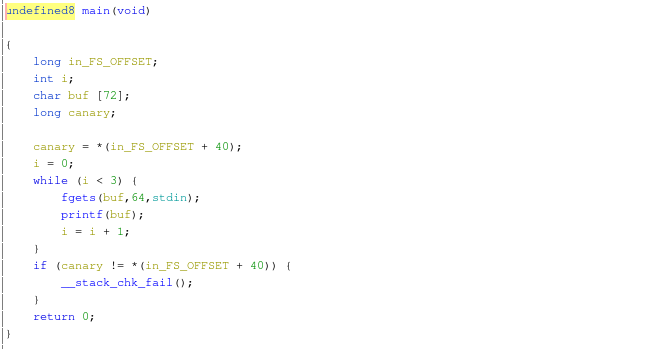

# my first echo server
__Category__: Pwn   
__Points__: 416   

> Hello there! I learnt C last week and already made my own      
> SaaS product, check it out! I even made sure not to use   
> compiler flags like --please-make-me-extremely-insecure,  
> so everything should be swell.
> 
> `nc chal.duc.tf 30001`
>
> Hint - The challenge server is running Ubuntu 18.04.
>
> Attachement: [echos](./echos)

### Challenge Overview
This challenge was pretty straightforward: You can control a format-string in 3 subsequent calls to printf.   


### Exploit Overview
My exploit strategy was as follows:
1. Leak libc address
2. Overwrite `__malloc_hook`
3. Trigger `malloc()` inside `printf()`

But first we needed to find the correct libc because "Ubuntu 18.04" is a bit vague. To do that leak the saved basepointer of main() and (apparently) substract 2192 from it to get the base address of the binary. After that you can leak
some .got values with `%X$s` where argument number `X` contains the address.   
I went for `printf` and `setvbuf`:
```
[*] printf @ 0x7fb56b96ee80
[*] setvbuf @ 0x7fb56b98b2f0
```
Entering the offsets into a [libc-database](https://libc.rip) yielded that the libc in use is libc6_2.27-3ubuntu1_amd64.   
This step is actually important because if you go to packages.ubuntu.com
directly and download the libc6-package for bionic you will get another libc which won't work.

__1. Leak libc address__   
This can be done by leaking the return-address of `main()`.   
The stackframe of main() looks like this:   

| rbp-Offset | Content           | printf argument # |
|-----------|-------------------|-----------------|
| +8        | Return address    | 19
| 0         | Saved Basepointer | 18
| -8        | Canary            | 17
| -16       | (Padding)         | 16
| -80       | input buffer       | 8 - 15
| -96       | (Padding)         | 6 - 7

The argument indices start at 6 because the ABI dictates that the first 6   
arguments go into some registers. The first argument is the format-string   
leaving 5 registers for printf arguments. Those would have printf argument numbers 1 - 5.   

Thus the format string for leaking libc is: `%19$lx`

__2. Overwrite __malloc_hook__  
[malloc_hook(3)](https://www.man7.org/linux/man-pages/man3/malloc_hook.3.html) is a special variable inside glibc that lets you override default malloc-behaviour. When malloc is called it checks whether this variable is set and
transfers control to the hook if so. So it is effectively a function pointer.   
The format-string that can overwrite the hook is based on `%n`, must be
constructed dynamically though.
See [exploit.py](./exploit.py) for more details on how to construct such a format-string.

__3. Trigger malloc inside printf__   
This can be done by causing a huge output like `%65510c` or `%90000c`.

### Flag
DUCTF{D@N6340U$_AF_F0RMAT_STTR1NG$}
